Deep discovery enabled. Searching for all related objects.
Fetching all potential resources for deep discovery...
Identifying seed objects for release 'datastore'...
Starting recursive discovery from seed objects...

Discovery complete. Found a total of 12 related objects.
Applying filters to discovered objects...
Filters applied. 12 objects remaining for diagram.
Building relationship map...
Generating Mermaid diagram with color-coded kinds...

#### Release: datastore | Namespace: apigee

```mermaid
graph TD;
    classDef helm fill:#f9f,stroke:#333,stroke-width:2px,color:#000
    classDef workload fill:#cce5ff,stroke:#004085,stroke-width:1px,color:#000
    classDef network fill:#d4edda,stroke:#155724,stroke-width:1px,color:#000
    classDef config fill:#e2e3e5,stroke:#383d41,stroke-width:1px,color:#000
    classDef rbac fill:#f8d7da,stroke:#721c24,stroke-width:1px,color:#000
    classDef apigee_crd fill:#fff3cd,stroke:#856404,stroke-width:2px,color:#000
    classDef cert_manager_crd fill:#d1ecf1,stroke:#0c5460,stroke-width:2px,color:#000
    classDef webhook fill:#ddd,stroke:#333,stroke-width:2px,color:#000
    classDef default fill:#fff,stroke:#333,stroke-width:1px,color:#000

    ApigeeDatastoredefault["ApigeeDatastore/default"]
    StatefulSetapigeecassandradefault["StatefulSet/apigee-cassandra-default"]
    Serviceapigeecassandradefault["Service/apigee-cassandra-default"]
    Secretconfigcassandradefault["Secret/config-cassandra-default"]
    ServiceAccountapigeecassandradefault["ServiceAccount/apigee-cassandra-default"]
    Certificateapigeecassandradefault["Certificate/apigee-cassandra-default"]
    Podapigeecassandradefault0["Pod/apigee-cassandra-default-0"]
    Podapigeecassandradefault1["Pod/apigee-cassandra-default-1"]
    Podapigeecassandradefault2["Pod/apigee-cassandra-default-2"]
    HelmReleasedatastore["Helm Release: datastore"]
    Secretapigeedatastoredefaultcreds["Secret/apigee-datastore-default-creds"]
    ServiceAccountapigeecassandrabackupsa["ServiceAccount/apigee-cassandra-backup-sa"]
    Certificateapigeecassandrabackuptls["Certificate/apigee-cassandra-backup-tls"]

    class ApigeeDatastoredefault apigee_crd;
    class StatefulSetapigeecassandradefault workload;
    class Serviceapigeecassandradefault network;
    class Secretconfigcassandradefault config;
    class ServiceAccountapigeecassandradefault rbac;
    class Certificateapigeecassandradefault cert_manager_crd;
    class Podapigeecassandradefault0 workload;
    class Podapigeecassandradefault1 workload;
    class Podapigeecassandradefault2 workload;
    class HelmReleasedatastore helm;
    class Secretapigeedatastoredefaultcreds config;
    class ServiceAccountapigeecassandrabackupsa rbac;
    class Certificateapigeecassandrabackuptls cert_manager_crd;

    ApigeeDatastoredefault --> StatefulSetapigeecassandradefault
    ApigeeDatastoredefault --> Serviceapigeecassandradefault
    ApigeeDatastoredefault --> Secretconfigcassandradefault
    ApigeeDatastoredefault --> ServiceAccountapigeecassandradefault
    ApigeeDatastoredefault --> Certificateapigeecassandradefault
    StatefulSetapigeecassandradefault --> Podapigeecassandradefault0
    StatefulSetapigeecassandradefault --> Podapigeecassandradefault1
    StatefulSetapigeecassandradefault --> Podapigeecassandradefault2
    HelmReleasedatastore --> Secretapigeedatastoredefaultcreds
    HelmReleasedatastore --> ServiceAccountapigeecassandrabackupsa
    HelmReleasedatastore --> Certificateapigeecassandrabackuptls
    HelmReleasedatastore --> ApigeeDatastoredefault
```

