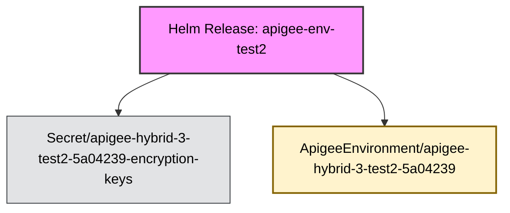

Deep discovery disabled. Searching for Helm-managed objects only.
Fetching all potential resources for shallow discovery...
Identifying objects directly managed by release 'apigee-env-test2'...

Discovery complete. Found a total of 2 related objects.
Applying filters to discovered objects...
Filters applied. 2 objects remaining for diagram.
Building relationship map...
Generating Mermaid diagram with color-coded kinds...

#### Release: apigee-env-test2 | Namespace: apigee

