Deep discovery enabled. Searching for all related objects.
Fetching all potential resources for deep discovery...
Identifying seed objects for release 'operator'...
Starting recursive discovery from seed objects...

Discovery complete. Found a total of 37 related objects.
Applying filters to discovered objects...
Filters applied. 13 objects remaining for diagram.
Building relationship map...
Generating Mermaid diagram with color-coded kinds...

#### Release: operator | Namespace: apigee

```mermaid
graph TD;
    classDef helm fill:#f9f,stroke:#333,stroke-width:2px,color:#000
    classDef workload fill:#cce5ff,stroke:#004085,stroke-width:1px,color:#000
    classDef network fill:#d4edda,stroke:#155724,stroke-width:1px,color:#000
    classDef config fill:#e2e3e5,stroke:#383d41,stroke-width:1px,color:#000
    classDef rbac fill:#f8d7da,stroke:#721c24,stroke-width:1px,color:#000
    classDef apigee_crd fill:#fff3cd,stroke:#856404,stroke-width:2px,color:#000
    classDef cert_manager_crd fill:#d1ecf1,stroke:#0c5460,stroke-width:2px,color:#000
    classDef webhook fill:#ddd,stroke:#333,stroke-width:2px,color:#000
    classDef default fill:#fff,stroke:#333,stroke-width:1px,color:#000

    Deploymentapigeecontrollermanager["Deployment/apigee-controller-manager"]
    ReplicaSetapigeecontrollermanager64997787fb["ReplicaSet/apigee-controller-manager-64997787fb"]
    ReplicaSetapigeecontrollermanager6c74bbd4fb["ReplicaSet/apigee-controller-manager-6c74bbd4fb"]
    Podapigeecontrollermanager6c74bbd4fbnnd8p["Pod/apigee-controller-manager-6c74bbd4fb-nnd8p"]
    HelmReleaseoperator["Helm Release: operator"]
    Serviceapigeecontrollermanagermetricsservice["Service/apigee-controller-manager-metrics-service"]
    Serviceapigeewebhookservice["Service/apigee-webhook-service"]
    ServiceAccountapigeemanager["ServiceAccount/apigee-manager"]
    ServiceAccountapigeemetricsadapter["ServiceAccount/apigee-metrics-adapter"]
    Certificateapigeeservingcert["Certificate/apigee-serving-cert"]
    MutatingWebhookConfigurationapigeemutatingwebhookconfigurationapigee["MutatingWebhookConfiguration/apigee-mutating-webhook-configuration-apigee"]
    ValidatingWebhookConfigurationapigeevalidatingwebhookconfigurationapigee["ValidatingWebhookConfiguration/apigee-validating-webhook-configuration-apigee"]
    ClusterIssuerapigeecaissuer["ClusterIssuer/apigee-ca-issuer"]
    ClusterIssuerapigeerootcertificateissuer["ClusterIssuer/apigee-root-certificate-issuer"]

    class Deploymentapigeecontrollermanager workload;
    class ReplicaSetapigeecontrollermanager64997787fb workload;
    class ReplicaSetapigeecontrollermanager6c74bbd4fb workload;
    class Podapigeecontrollermanager6c74bbd4fbnnd8p workload;
    class HelmReleaseoperator helm;
    class Serviceapigeecontrollermanagermetricsservice network;
    class Serviceapigeewebhookservice network;
    class ServiceAccountapigeemanager rbac;
    class ServiceAccountapigeemetricsadapter rbac;
    class Certificateapigeeservingcert cert_manager_crd;
    class MutatingWebhookConfigurationapigeemutatingwebhookconfigurationapigee webhook;
    class ValidatingWebhookConfigurationapigeevalidatingwebhookconfigurationapigee webhook;
    class ClusterIssuerapigeecaissuer cert_manager_crd;
    class ClusterIssuerapigeerootcertificateissuer cert_manager_crd;

    Deploymentapigeecontrollermanager --> ReplicaSetapigeecontrollermanager64997787fb
    Deploymentapigeecontrollermanager --> ReplicaSetapigeecontrollermanager6c74bbd4fb
    ReplicaSetapigeecontrollermanager6c74bbd4fb --> Podapigeecontrollermanager6c74bbd4fbnnd8p
    HelmReleaseoperator --> Deploymentapigeecontrollermanager
    HelmReleaseoperator --> Serviceapigeecontrollermanagermetricsservice
    HelmReleaseoperator --> Serviceapigeewebhookservice
    HelmReleaseoperator --> ServiceAccountapigeemanager
    HelmReleaseoperator --> ServiceAccountapigeemetricsadapter
    HelmReleaseoperator --> Certificateapigeeservingcert
    HelmReleaseoperator --> MutatingWebhookConfigurationapigeemutatingwebhookconfigurationapigee
    HelmReleaseoperator --> ValidatingWebhookConfigurationapigeevalidatingwebhookconfigurationapigee
    HelmReleaseoperator --> ClusterIssuerapigeecaissuer
    HelmReleaseoperator --> ClusterIssuerapigeerootcertificateissuer
```

