Deep discovery disabled. Searching for Helm-managed objects only.
Fetching all potential resources for shallow discovery...
Identifying objects directly managed by release 'apigee-hybrid-378710'...

Discovery complete. Found a total of 6 related objects.
Applying filters to discovered objects...
Filters applied. 6 objects remaining for diagram.
Building relationship map...
Generating Mermaid diagram with color-coded kinds...

#### Release: apigee-hybrid-378710 | Namespace: apigee

```mermaid
graph TD;
    classDef helm fill:#f9f,stroke:#333,stroke-width:2px,color:#000
    classDef workload fill:#cce5ff,stroke:#004085,stroke-width:1px,color:#000
    classDef network fill:#d4edda,stroke:#155724,stroke-width:1px,color:#000
    classDef config fill:#e2e3e5,stroke:#383d41,stroke-width:1px,color:#000
    classDef rbac fill:#f8d7da,stroke:#721c24,stroke-width:1px,color:#000
    classDef apigee_crd fill:#fff3cd,stroke:#856404,stroke-width:2px,color:#000
    classDef cert_manager_crd fill:#d1ecf1,stroke:#0c5460,stroke-width:2px,color:#000
    classDef webhook fill:#ddd,stroke:#333,stroke-width:2px,color:#000
    classDef default fill:#fff,stroke:#333,stroke-width:1px,color:#000

    HelmReleaseapigeehybrid378710["Helm Release: apigee-hybrid-378710"]
    Secretapigeehybrid397e66abaxsalt["Secret/apigee-hybrid-3-97e66ab-ax-salt"]
    Secretapigeehybrid397e66abdataencryption["Secret/apigee-hybrid-3-97e66ab-data-encryption"]
    Secretapigeehybrid397e66abencryptionkeys["Secret/apigee-hybrid-3-97e66ab-encryption-keys"]
    Certificateapigeeingressgatewayinternalchainingapigeehybrid397e66ab["Certificate/apigee-ingressgateway-internal-chaining-apigee-hybrid-3-97e66ab"]
    ApigeeOrganizationapigeehybrid397e66ab["ApigeeOrganization/apigee-hybrid-3-97e66ab"]
    ApigeeRouteapigeeingressgatewayinternalchainingapigeehybrid397e66ab["ApigeeRoute/apigee-ingressgateway-internal-chaining-apigee-hybrid-3-97e66ab"]

    class HelmReleaseapigeehybrid378710 helm;
    class Secretapigeehybrid397e66abaxsalt config;
    class Secretapigeehybrid397e66abdataencryption config;
    class Secretapigeehybrid397e66abencryptionkeys config;
    class Certificateapigeeingressgatewayinternalchainingapigeehybrid397e66ab cert_manager_crd;
    class ApigeeOrganizationapigeehybrid397e66ab apigee_crd;
    class ApigeeRouteapigeeingressgatewayinternalchainingapigeehybrid397e66ab apigee_crd;

    HelmReleaseapigeehybrid378710 --> Secretapigeehybrid397e66abaxsalt
    HelmReleaseapigeehybrid378710 --> Secretapigeehybrid397e66abdataencryption
    HelmReleaseapigeehybrid378710 --> Secretapigeehybrid397e66abencryptionkeys
    HelmReleaseapigeehybrid378710 --> Certificateapigeeingressgatewayinternalchainingapigeehybrid397e66ab
    HelmReleaseapigeehybrid378710 --> ApigeeOrganizationapigeehybrid397e66ab
    HelmReleaseapigeehybrid378710 --> ApigeeRouteapigeeingressgatewayinternalchainingapigeehybrid397e66ab
```

