Deep discovery enabled. Searching for all related objects.
Fetching all potential resources for deep discovery...
Identifying seed objects for release 'redis'...
Starting recursive discovery from seed objects...

Discovery complete. Found a total of 18 related objects.
No filters applied. Including all discovered objects.
Building relationship map...
Generating Mermaid diagram with color-coded kinds...

#### Release: redis | Namespace: apigee

```mermaid
graph TD;
    classDef helm fill:#f9f,stroke:#333,stroke-width:2px,color:#000
    classDef workload fill:#cce5ff,stroke:#004085,stroke-width:1px,color:#000
    classDef network fill:#d4edda,stroke:#155724,stroke-width:1px,color:#000
    classDef config fill:#e2e3e5,stroke:#383d41,stroke-width:1px,color:#000
    classDef rbac fill:#f8d7da,stroke:#721c24,stroke-width:1px,color:#000
    classDef apigee_crd fill:#fff3cd,stroke:#856404,stroke-width:2px,color:#000
    classDef cert_manager_crd fill:#d1ecf1,stroke:#0c5460,stroke-width:2px,color:#000
    classDef webhook fill:#ddd,stroke:#333,stroke-width:2px,color:#000
    classDef default fill:#fff,stroke:#333,stroke-width:1px,color:#000

    ApigeeRedisdefault["ApigeeRedis/default"]
    StatefulSetapigeeredisdefault["StatefulSet/apigee-redis-default"]
    Serviceapigeeredisdefault["Service/apigee-redis-default"]
    ConfigMapapigeeredisenvoystaticconfig["ConfigMap/apigee-redis-envoy-static-config"]
    Secretapigeeredisconfig["Secret/apigee-redis-config"]
    Secretapigeeredisdefaultcredsce6e0e["Secret/apigee-redis-default-creds-ce6e0e"]
    ServiceAccountapigeeredisdefault["ServiceAccount/apigee-redis-default"]
    ServiceAccountapigeeredisenvoydefault["ServiceAccount/apigee-redis-envoy-default"]
    Certificateapigeeredisdefault["Certificate/apigee-redis-default"]
    Certificateapigeeredisenvoydefault["Certificate/apigee-redis-envoy-default"]
    ApigeeDeploymentapigeeredisenvoydefault["ApigeeDeployment/apigee-redis-envoy-default"]
    Podapigeeredisdefault0["Pod/apigee-redis-default-0"]
    Podapigeeredisdefault1["Pod/apigee-redis-default-1"]
    V2HorizontalPodAutoscalerapigeeredisenvoydefault1150xt1ac["V2HorizontalPodAutoscaler/apigee-redis-envoy-default-1150-xt1ac"]
    ReplicaSetapigeeredisenvoydefault1150xt1ac["ReplicaSet/apigee-redis-envoy-default-1150-xt1ac"]
    Serviceapigeeredisenvoydefault["Service/apigee-redis-envoy-default"]
    Podapigeeredisenvoydefault1150xt1acgqrzh["Pod/apigee-redis-envoy-default-1150-xt1ac-gqrzh"]
    HelmReleaseredis["Helm Release: redis"]
    Secretapigeeredisdefaultcreds["Secret/apigee-redis-default-creds"]

    class ApigeeRedisdefault apigee_crd;
    class StatefulSetapigeeredisdefault workload;
    class Serviceapigeeredisdefault network;
    class ConfigMapapigeeredisenvoystaticconfig config;
    class Secretapigeeredisconfig config;
    class Secretapigeeredisdefaultcredsce6e0e config;
    class ServiceAccountapigeeredisdefault rbac;
    class ServiceAccountapigeeredisenvoydefault rbac;
    class Certificateapigeeredisdefault cert_manager_crd;
    class Certificateapigeeredisenvoydefault cert_manager_crd;
    class ApigeeDeploymentapigeeredisenvoydefault apigee_crd;
    class Podapigeeredisdefault0 workload;
    class Podapigeeredisdefault1 workload;
    class V2HorizontalPodAutoscalerapigeeredisenvoydefault1150xt1ac workload;
    class ReplicaSetapigeeredisenvoydefault1150xt1ac workload;
    class Serviceapigeeredisenvoydefault network;
    class Podapigeeredisenvoydefault1150xt1acgqrzh workload;
    class HelmReleaseredis helm;
    class Secretapigeeredisdefaultcreds config;

    ApigeeRedisdefault --> StatefulSetapigeeredisdefault
    ApigeeRedisdefault --> Serviceapigeeredisdefault
    ApigeeRedisdefault --> ConfigMapapigeeredisenvoystaticconfig
    ApigeeRedisdefault --> Secretapigeeredisconfig
    ApigeeRedisdefault --> Secretapigeeredisdefaultcredsce6e0e
    ApigeeRedisdefault --> ServiceAccountapigeeredisdefault
    ApigeeRedisdefault --> ServiceAccountapigeeredisenvoydefault
    ApigeeRedisdefault --> Certificateapigeeredisdefault
    ApigeeRedisdefault --> Certificateapigeeredisenvoydefault
    ApigeeRedisdefault --> ApigeeDeploymentapigeeredisenvoydefault
    StatefulSetapigeeredisdefault --> Podapigeeredisdefault0
    StatefulSetapigeeredisdefault --> Podapigeeredisdefault1
    ApigeeDeploymentapigeeredisenvoydefault --> V2HorizontalPodAutoscalerapigeeredisenvoydefault1150xt1ac
    ApigeeDeploymentapigeeredisenvoydefault --> ReplicaSetapigeeredisenvoydefault1150xt1ac
    ApigeeDeploymentapigeeredisenvoydefault --> Serviceapigeeredisenvoydefault
    ReplicaSetapigeeredisenvoydefault1150xt1ac --> Podapigeeredisenvoydefault1150xt1acgqrzh
    HelmReleaseredis --> Secretapigeeredisdefaultcreds
    HelmReleaseredis --> ApigeeRedisdefault
```

