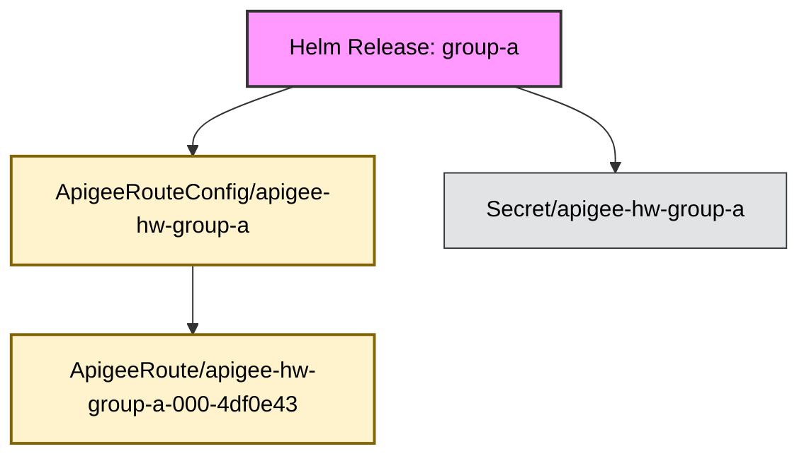

Deep discovery enabled. Searching for all related objects.
Fetching all potential resources for deep discovery...
Identifying seed objects for release 'group-a'...
Starting recursive discovery from seed objects...

Discovery complete. Found a total of 3 related objects.
Applying filters to discovered objects...
Filters applied. 3 objects remaining for diagram.
Building relationship map...
Generating Mermaid diagram with color-coded kinds...

#### Release: group-a | Namespace: apigee

