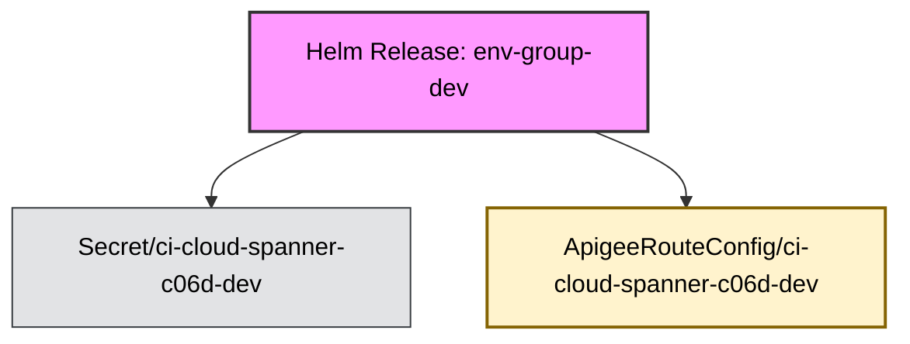

Deep discovery disabled. Searching for Helm-managed objects only.
Fetching all potential resources for shallow discovery...
Identifying objects directly managed by release 'env-group-dev'...

Discovery complete. Found a total of 2 related objects.
No filters applied. Including all discovered objects.
Building relationship map...
Generating Mermaid diagram with color-coded kinds...

#### Release: env-group-dev | Namespace: apigee

