Deep discovery enabled. Searching for all related objects.
Fetching all potential resources for deep discovery...
Identifying seed objects for release 'dev'...
Starting recursive discovery from seed objects...

Discovery complete. Found a total of 17 related objects.
Building relationship map...
Generating Mermaid diagram...
#### Release dev -> Namespace apigee

```mermaid
graph TD;
    classDef helm fill:#f9f,stroke:#333,stroke-width:2px;
    classDef primitive fill:#d4edda,stroke:#155724,stroke-width:1px;
    classDef apigee_crd fill:#fff3cd,stroke:#856404,stroke-width:2px;
    ApigeeEnvironmentcicloudspannedevda008e1["ApigeeEnvironment/ci-cloud-spanne-dev-da008e1"]
    class ApigeeEnvironmentcicloudspannedevda008e1 apigee_crd;
    ConfigMapapigeesynchronizercicloudspadevdggroupconfib809b91["ConfigMap/apigee-synchronizer-ci-cloud-spa-dev-dggroupconfi-b809b91"]
    class ConfigMapapigeesynchronizercicloudspadevdggroupconfib809b91 primitive;
    ApigeeEnvironmentcicloudspannedevda008e1 --> ConfigMapapigeesynchronizercicloudspadevdggroupconfib809b91
    ConfigMapapigeesynchronizerdevaddonmap["ConfigMap/apigee-synchronizer-dev-add-on-map"]
    class ConfigMapapigeesynchronizerdevaddonmap primitive;
    ApigeeEnvironmentcicloudspannedevda008e1 --> ConfigMapapigeesynchronizerdevaddonmap
    Secretapigeeruntimecicloudspannedevda008e1config74d732["Secret/apigee-runtime-ci-cloud-spanne-dev-da008e1-config-74d732"]
    class Secretapigeeruntimecicloudspannedevda008e1config74d732 primitive;
    ApigeeEnvironmentcicloudspannedevda008e1 --> Secretapigeeruntimecicloudspannedevda008e1config74d732
    Secretapigeesynchronizercicloudspannedevda008e1configd0d6a3["Secret/apigee-synchronizer-ci-cloud-spanne-dev-da008e1-config-d0d6a3"]
    class Secretapigeesynchronizercicloudspannedevda008e1configd0d6a3 primitive;
    ApigeeEnvironmentcicloudspannedevda008e1 --> Secretapigeesynchronizercicloudspannedevda008e1configd0d6a3
    ServiceAccountapigeesynchronizercicloudspannedevda008e1["ServiceAccount/apigee-synchronizer-ci-cloud-spanne-dev-da008e1"]
    class ServiceAccountapigeesynchronizercicloudspannedevda008e1 primitive;
    ApigeeEnvironmentcicloudspannedevda008e1 --> ServiceAccountapigeesynchronizercicloudspannedevda008e1
    ApigeeDeploymentapigeeruntimecicloudspannedevda008e1["ApigeeDeployment/apigee-runtime-ci-cloud-spanne-dev-da008e1"]
    class ApigeeDeploymentapigeeruntimecicloudspannedevda008e1 apigee_crd;
    ApigeeEnvironmentcicloudspannedevda008e1 --> ApigeeDeploymentapigeeruntimecicloudspannedevda008e1
    ApigeeDeploymentapigeesynchronizercicloudspannedevda008e1["ApigeeDeployment/apigee-synchronizer-ci-cloud-spanne-dev-da008e1"]
    class ApigeeDeploymentapigeesynchronizercicloudspannedevda008e1 apigee_crd;
    ApigeeEnvironmentcicloudspannedevda008e1 --> ApigeeDeploymentapigeesynchronizercicloudspannedevda008e1
    Certificateapigeeruntimecicloudspannedevda008e1["Certificate/apigee-runtime-ci-cloud-spanne-dev-da008e1"]
    class Certificateapigeeruntimecicloudspannedevda008e1 primitive;
    ApigeeEnvironmentcicloudspannedevda008e1 --> Certificateapigeeruntimecicloudspannedevda008e1
    Certificateapigeesynchronizercicloudspannedevda008e1["Certificate/apigee-synchronizer-ci-cloud-spanne-dev-da008e1"]
    class Certificateapigeesynchronizercicloudspannedevda008e1 primitive;
    ApigeeEnvironmentcicloudspannedevda008e1 --> Certificateapigeesynchronizercicloudspannedevda008e1
    ReplicaSetapigeeruntimecicloudspannedevda008e11150gxh0z["ReplicaSet/apigee-runtime-ci-cloud-spanne-dev-da008e1-1150-gxh0z"]
    class ReplicaSetapigeeruntimecicloudspannedevda008e11150gxh0z primitive;
    ApigeeDeploymentapigeeruntimecicloudspannedevda008e1 --> ReplicaSetapigeeruntimecicloudspannedevda008e11150gxh0z
    Serviceapigeeruntimecicloudspannedevda008e1["Service/apigee-runtime-ci-cloud-spanne-dev-da008e1"]
    class Serviceapigeeruntimecicloudspannedevda008e1 primitive;
    ApigeeDeploymentapigeeruntimecicloudspannedevda008e1 --> Serviceapigeeruntimecicloudspannedevda008e1
    ReplicaSetapigeesynchronizercicloudspannedevda008e1115040ltr["ReplicaSet/apigee-synchronizer-ci-cloud-spanne-dev-da008e1-1150-40ltr"]
    class ReplicaSetapigeesynchronizercicloudspannedevda008e1115040ltr primitive;
    ApigeeDeploymentapigeesynchronizercicloudspannedevda008e1 --> ReplicaSetapigeesynchronizercicloudspannedevda008e1115040ltr
    Serviceapigeesynchronizercicloudspannedevda008e1["Service/apigee-synchronizer-ci-cloud-spanne-dev-da008e1"]
    class Serviceapigeesynchronizercicloudspannedevda008e1 primitive;
    ApigeeDeploymentapigeesynchronizercicloudspannedevda008e1 --> Serviceapigeesynchronizercicloudspannedevda008e1
    Podapigeeruntimecicloudspannedevda008e11150gxh0znx4tr["Pod/apigee-runtime-ci-cloud-spanne-dev-da008e1-1150-gxh0z-nx4tr"]
    class Podapigeeruntimecicloudspannedevda008e11150gxh0znx4tr primitive;
    ReplicaSetapigeeruntimecicloudspannedevda008e11150gxh0z --> Podapigeeruntimecicloudspannedevda008e11150gxh0znx4tr
    Podapigeesynchronizercicloudspannedevda008e1115040ltr2xqr7["Pod/apigee-synchronizer-ci-cloud-spanne-dev-da008e1-1150-40ltr2xqr7"]
    class Podapigeesynchronizercicloudspannedevda008e1115040ltr2xqr7 primitive;
    ReplicaSetapigeesynchronizercicloudspannedevda008e1115040ltr --> Podapigeesynchronizercicloudspannedevda008e1115040ltr2xqr7
    HelmReleasedev["Helm Release: dev"]
    class HelmReleasedev helm;
    Secretcicloudspannedevda008e1encryptionkeys["Secret/ci-cloud-spanne-dev-da008e1-encryption-keys"]
    class Secretcicloudspannedevda008e1encryptionkeys primitive;
    HelmReleasedev --> Secretcicloudspannedevda008e1encryptionkeys
    HelmReleasedev --> ApigeeEnvironmentcicloudspannedevda008e1
```

