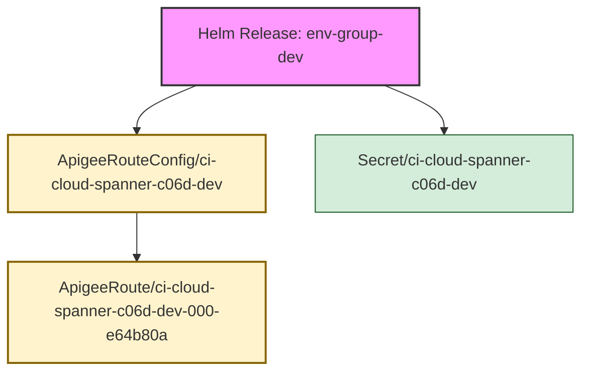

Deep discovery enabled. Searching for all related objects.
Fetching all potential resources for deep discovery...
Identifying seed objects for release 'env-group-dev'...
Starting recursive discovery from seed objects...

Discovery complete. Found a total of 3 related objects.
Building relationship map...
Generating Mermaid diagram...
#### Release env-group-dev -> Namespace apigee

