Deep discovery enabled. Searching for all related objects.
Fetching all potential resources for deep discovery...
Identifying seed objects for release 'ingress-manager'...
Starting recursive discovery from seed objects...

Discovery complete. Found a total of 11 related objects.
Filters applied. 11 objects remaining for diagram.
Building relationship map...
Generating Mermaid diagram with color-coded kinds...

#### Release: ingress-manager | Namespace: apigee

```mermaid
graph TD;
    classDef helm fill:#f9f,stroke:#333,stroke-width:2px,color:#000
    classDef workload fill:#cce5ff,stroke:#004085,stroke-width:1px,color:#000
    classDef network fill:#d4edda,stroke:#155724,stroke-width:1px,color:#000
    classDef config fill:#e2e3e5,stroke:#383d41,stroke-width:1px,color:#000
    classDef rbac fill:#f8d7da,stroke:#721c24,stroke-width:1px,color:#000
    classDef apigee_crd fill:#fff3cd,stroke:#856404,stroke-width:2px,color:#000
    classDef cert_manager_crd fill:#d1ecf1,stroke:#0c5460,stroke-width:2px,color:#000
    classDef webhook fill:#ddd,stroke:#333,stroke-width:2px,color:#000
    classDef default fill:#fff,stroke:#333,stroke-width:1px,color:#000

    Deploymentapigeeingressgatewaymanager["Deployment/apigee-ingressgateway-manager"]
    ReplicaSetapigeeingressgatewaymanager54b5799f4d["ReplicaSet/apigee-ingressgateway-manager-54b5799f4d"]
    ReplicaSetapigeeingressgatewaymanager5967c955ff["ReplicaSet/apigee-ingressgateway-manager-5967c955ff"]
    Podapigeeingressgatewaymanager54b5799f4d7gchs["Pod/apigee-ingressgateway-manager-54b5799f4d-7gchs"]
    Podapigeeingressgatewaymanager54b5799f4dhbwth["Pod/apigee-ingressgateway-manager-54b5799f4d-hbwth"]
    HelmReleaseingressmanager["Helm Release: ingress-manager"]
    Serviceapigeeingressgatewaymanager["Service/apigee-ingressgateway-manager"]
    ConfigMapapigeeenvoyfilters["ConfigMap/apigee-envoyfilters"]
    ConfigMapapigeeistiomeshconfig["ConfigMap/apigee-istio-mesh-config"]
    ServiceAccountapigeeingressgateway["ServiceAccount/apigee-ingressgateway"]
    ServiceAccountapigeeingressgatewaymanager["ServiceAccount/apigee-ingressgateway-manager"]
    Certificateapigeeistiod["Certificate/apigee-istiod"]

    class Deploymentapigeeingressgatewaymanager workload;
    class ReplicaSetapigeeingressgatewaymanager54b5799f4d workload;
    class ReplicaSetapigeeingressgatewaymanager5967c955ff workload;
    class Podapigeeingressgatewaymanager54b5799f4d7gchs workload;
    class Podapigeeingressgatewaymanager54b5799f4dhbwth workload;
    class HelmReleaseingressmanager helm;
    class Serviceapigeeingressgatewaymanager network;
    class ConfigMapapigeeenvoyfilters config;
    class ConfigMapapigeeistiomeshconfig config;
    class ServiceAccountapigeeingressgateway rbac;
    class ServiceAccountapigeeingressgatewaymanager rbac;
    class Certificateapigeeistiod cert_manager_crd;

    Deploymentapigeeingressgatewaymanager --> ReplicaSetapigeeingressgatewaymanager54b5799f4d
    Deploymentapigeeingressgatewaymanager --> ReplicaSetapigeeingressgatewaymanager5967c955ff
    ReplicaSetapigeeingressgatewaymanager54b5799f4d --> Podapigeeingressgatewaymanager54b5799f4d7gchs
    ReplicaSetapigeeingressgatewaymanager54b5799f4d --> Podapigeeingressgatewaymanager54b5799f4dhbwth
    HelmReleaseingressmanager --> Deploymentapigeeingressgatewaymanager
    HelmReleaseingressmanager --> Serviceapigeeingressgatewaymanager
    HelmReleaseingressmanager --> ConfigMapapigeeenvoyfilters
    HelmReleaseingressmanager --> ConfigMapapigeeistiomeshconfig
    HelmReleaseingressmanager --> ServiceAccountapigeeingressgateway
    HelmReleaseingressmanager --> ServiceAccountapigeeingressgatewaymanager
    HelmReleaseingressmanager --> Certificateapigeeistiod
```

