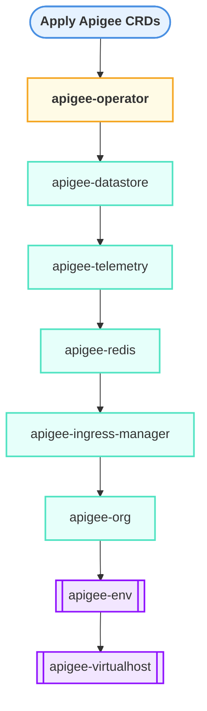

# Apigee Hybrid Helm Chart Dpeloyment Flow Sequence 

## Helm anatomy
```mermad
graph TD
    subgraph "A) Helm Chart ('my-helm-chart/')"
    
        direction LR
        ChartMeta["Chart.yaml<br/><i>(Metadata: name, version)</i>"]
        Values["values.yaml<br/><i>(Default Configuration)</i>"]
        Templates["templates/ Directory<br/><i>(K8s Manifest Templates)</i>"]
        
        subgraph " "
           direction TB
           T_Deploy["deployment.yaml<br/>spec:<br/>&nbsp;&nbsp;replicas: {{ .Values.replicaCount }}"]
           T_Svc["service.yaml<br/>spec:<br/>&nbsp;&nbsp;port: {{ .Values.service.port }}"]
        end
        Templates --> T_Deploy & T_Svc
    end

    subgraph "B) User's Configuration"
        UserValues["Custom Values<br/><i>(e.g., --set replicaCount=3)</i>"]
    end

    subgraph "C) The Helm Process"
        HelmCLI["<b>Helm Engine</b><br/><i>'helm install my-release ...'</i>"]
    end

    subgraph "D) The Result"
        Rendered["Rendered K8s Manifests<br/><i>(Final YAML)</i>"]
        K8sAPI["Kubernetes API Server"]
        
        subgraph "E) Running in Kubernetes Cluster (The 'Release')"
            direction LR
            Pod[Pod]
            Service[Service]
            Deployment[Deployment]
        end
    end

    %% Define the flow
    ChartMeta --> HelmCLI
    Values --> HelmCLI
    Templates --> HelmCLI
    UserValues --> HelmCLI

    HelmCLI -- Renders templates with values --> Rendered
    Rendered -- Sends to Kubernetes --> K8sAPI
    K8sAPI -- Creates Resources --> Deployment
    Deployment --> Pod
    K8sAPI --> Service
    
    %% Styling
    style HelmCLI fill:#0f9d58,stroke:#333,stroke-width:2px,color:#fff
    style K8sAPI fill:#326ce5,stroke:#333,stroke-width:2px,color:#fff
```

## Apigee Hybrid Helm sequnce
