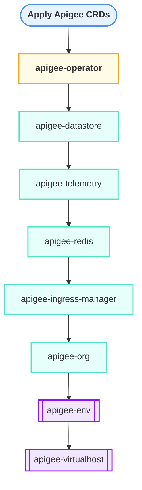

# Apigee Hybrid Helm Chart Dpeloyment Flow Sequence 

```mermaid
flowchart TD
    %% --- Style Definitions for different component types ---
    classDef prereq fill:#e6f2ff,stroke:#4a90e2,stroke-width:2px,font-weight:bold
    classDef operator fill:#fffbe6,stroke:#f5a623,stroke-width:2px,font-weight:bold
    classDef core fill:#e6fffa,stroke:#50e3c2,stroke-width:2px
    classDef runtime fill:#f2e6ff,stroke:#9013fe,stroke-width:2px

    %% --- Chart Structure ---

    %% 1. Prerequisite step
    A([Apply Apigee CRDs]):::prereq

    %% 2. Operator (Controller)
    B[apigee-operator]:::operator

    %% 3. Core singleton components
    C[apigee-datastore]:::core
    D[apigee-telemetry]:::core
    E[apigee-redis]:::core
    F[apigee-ingress-manager]:::core
    G[apigee-org]:::core

    %% 4. Repeatable runtime components
    H[[apigee-env]]:::runtime
    I[[apigee-virtualhost]]:::runtime

    A --> B --> C --> D --> E --> F --> G --> H --> I
```